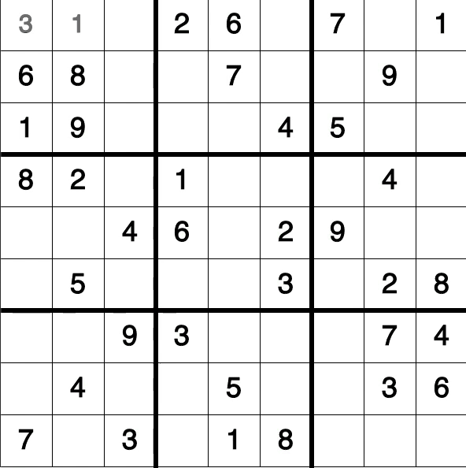
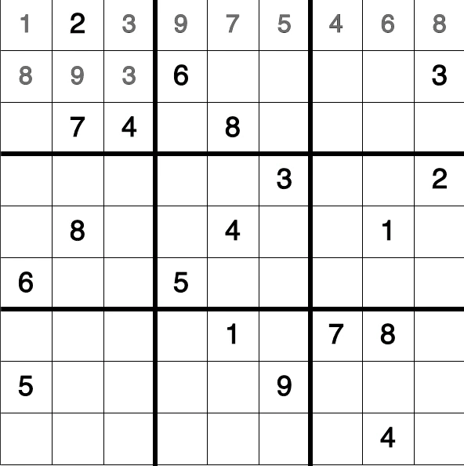
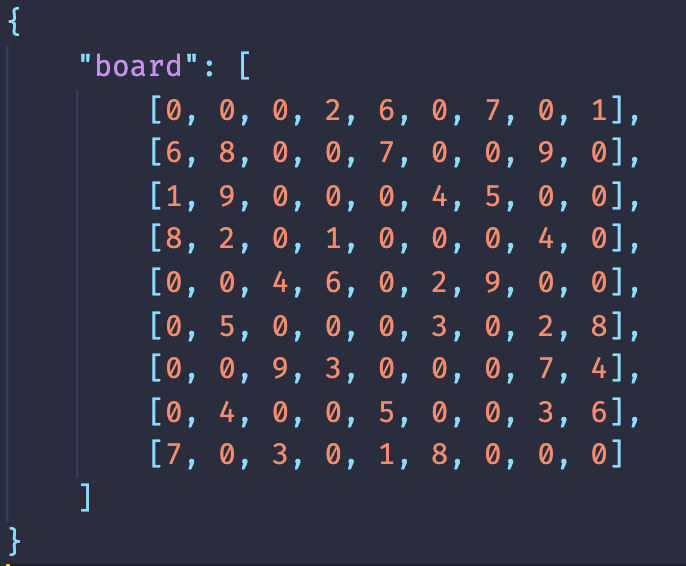

# sudoku-solver

### Solves any sudoku using a backtracking algorithm which can run at 1,000,000 iterations per second

Link to the hosted project: [Sudoku Solver](https://tansonlee.github.io/sudoku-solver/)

Made with JavaScript and visulaized with the p5.js library.

Solving an easy sudoku @60 iterations per second:
 

Solving a very hard sudoku @18,000 iterations per second:
 

### how to use to solve your own sudoku:

1. Find your sudoku and create a json file with the following format:
    
   
2. Add the file to the sudokus directory with the name "sudoku.json"
3. Wait for it to finish
4. Enjoy the solved sudoku

 
 
 

Sudokus from: https://dingo.sbs.arizona.edu/~sandiway/sudoku/examples.html
