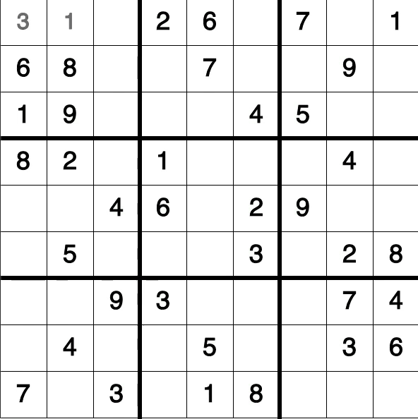
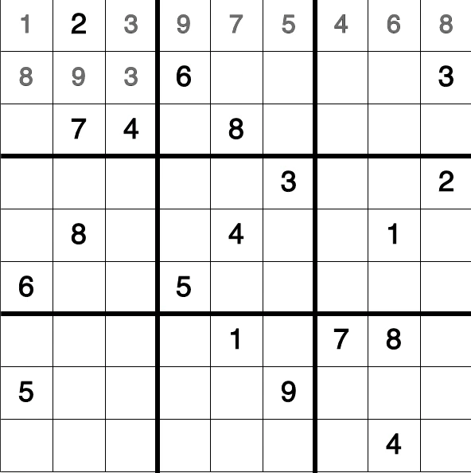
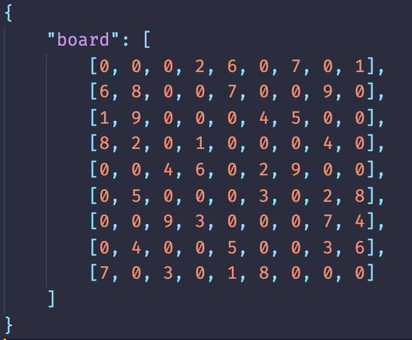

# sudoku-solver

Solves any sudoku using a backtracking algorithm which can run at 1,000,000 iterations per second

solving an easy sudoku @60 iterations per second:

solving a very hard sudoku @18,000 iterations per second:

how to use to solve your own sudoku:

1. find your sudoku and create a json file with the following format:
    
   
2. add the file to the root directory with the name "sudoku.json"

sudokus from: https://dingo.sbs.arizona.edu/~sandiway/sudoku/examples.html
